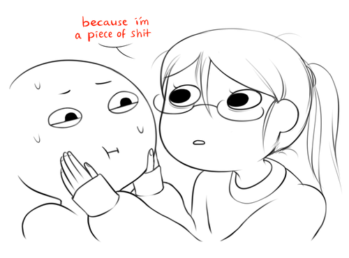

If you want to get stronger, be honest with yourself. Honestly speaking though, I think I'm a piece of shit.

And before you say, "nawww, I know you, this is just some play of self-pity, you're really a decent person." And to that, I say thank you, but I really am being honest when I say that. I do procrastinate still, and a lot, and spent most of my time wasting said precious time. The worst part is I am well aware of what I'm doing (or not doing).

Perhaps being honest to yourself isn't the solution. As much as I would love to embrace this mediocre, comfortable life, and would probably survive on it, I know there's so much more I am capable of, and have spent more effort on self-sabotage instead of capitalizing on this knowledge.

So lie? Lie about being someone industrious and dependable. Pretend to play the part of someone who actually contributes something to the community. Perhaps here, honesty isn't the solution. Gotta fake till you make it! Cliches are gr8.

Or maybe honesty is just part of the solution, and lying is part of the solution, and that the solution is so complex but worth understanding because it gives you a better impression of who you want to be and what you really want in life and wow before this starts to become even more deeper and complicated that may require a strong drink (sour milk?) I would stop here.
