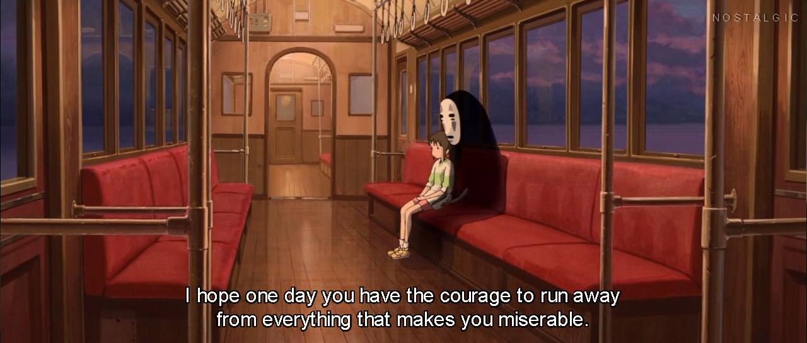

//Work.

I have been doing that all this time. Now is the time to rest.

//No, work doesn't end at the hospital. You know that better than I do.

Yes. There are cases to log, reports to finish, papers and deadlines. But may I please take this time to rest?

//Sure. We both know what you would do anyway. Succumb to that feeling of tiredness. Do your work when under extreme pressure to finish. That's how you survived this far, right?

Yes, thanks for the reminder. Look, I swear I'll finish it this week, alright? Just let me have these few hours to regain my energy.

//It's been years. What energy is there to regain? Filling emptiness with more emptiness doesn't accomplish much.

I know.

//\*sigh\* Admit it. You're tired. You're unhappy. You want to escape. This lifestyle, it's not working out for you.

It's a better life than most people have. And someday, when I finish this, things will change for the better. I can finally achieve a less toxic life with more freedom.

//That MAY be true, but at what cost?

The price is high. And I don't know if I could make it. I have lost so much for this already, and giving up feels like an act of cowardice.

//Whatever is you seek to gain here, it better be worth it then.

...
